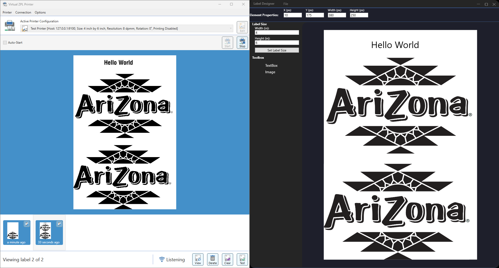
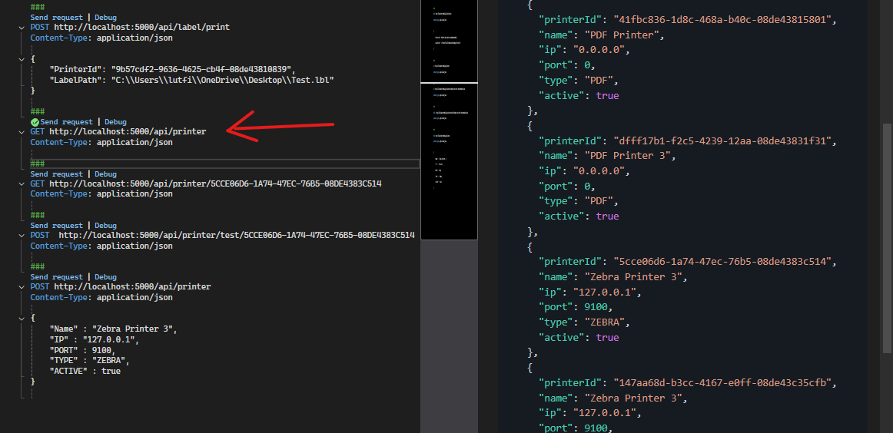
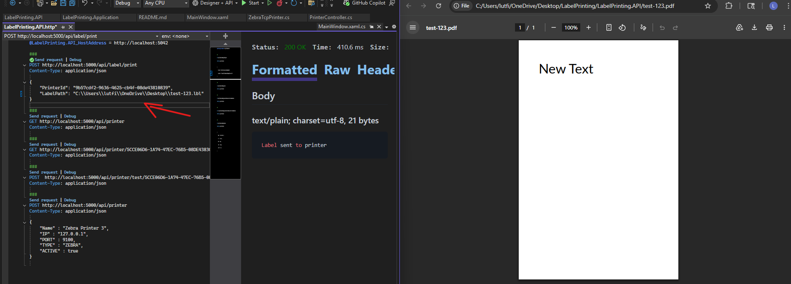
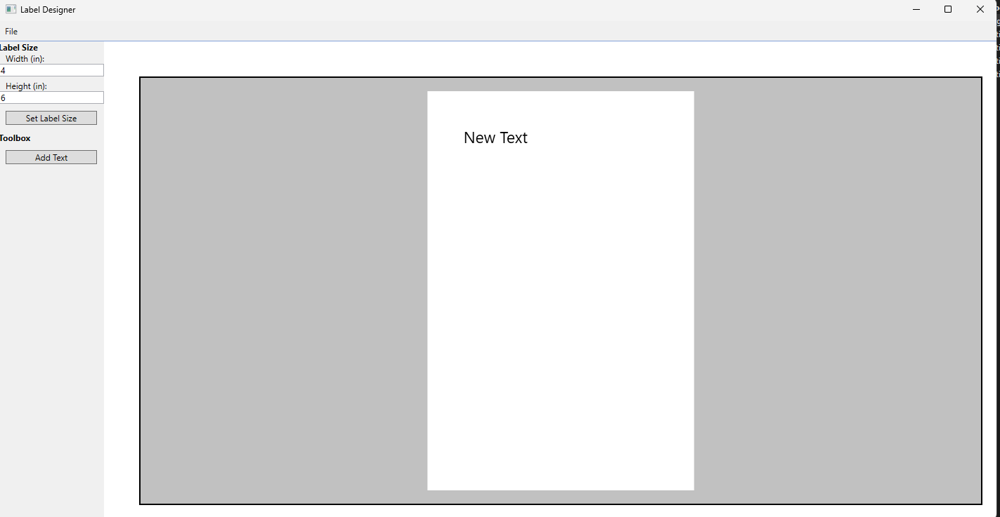
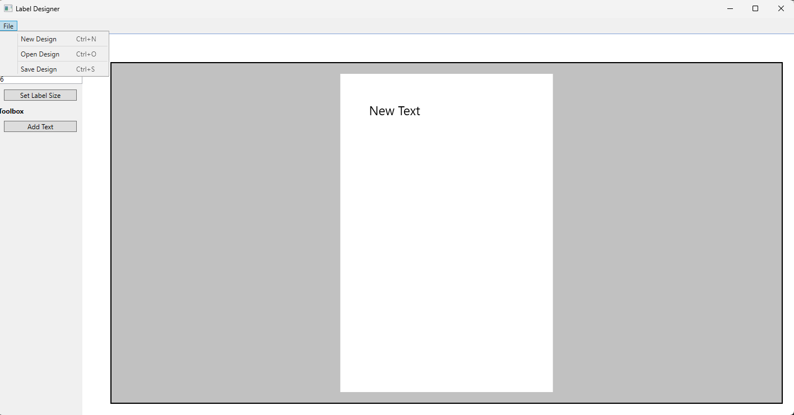
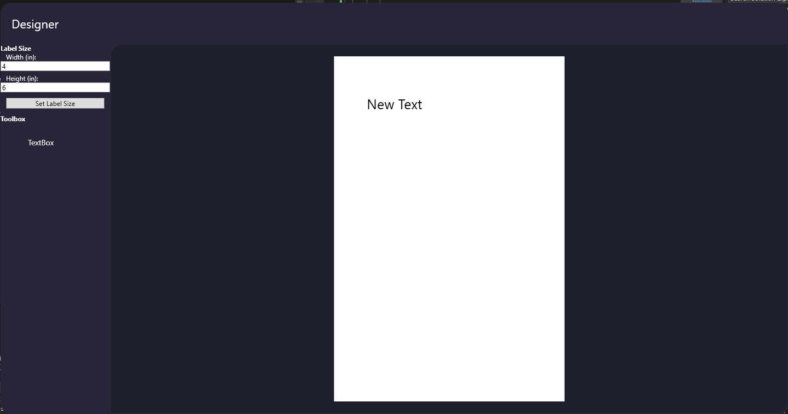
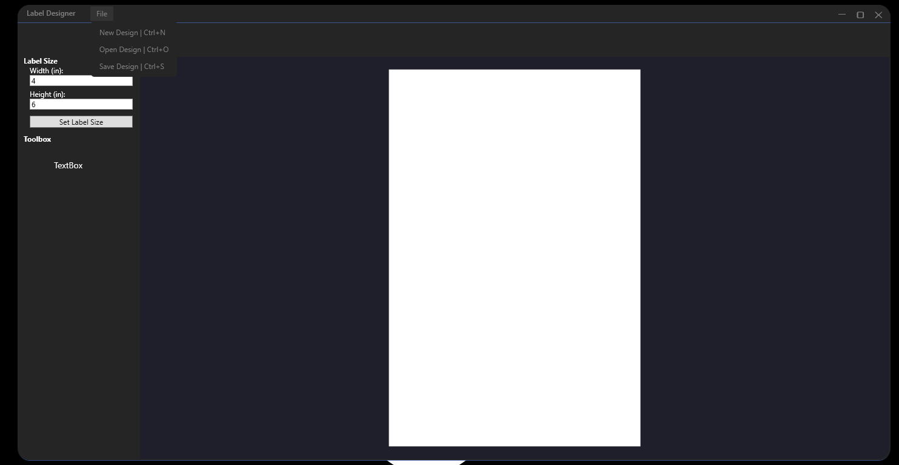
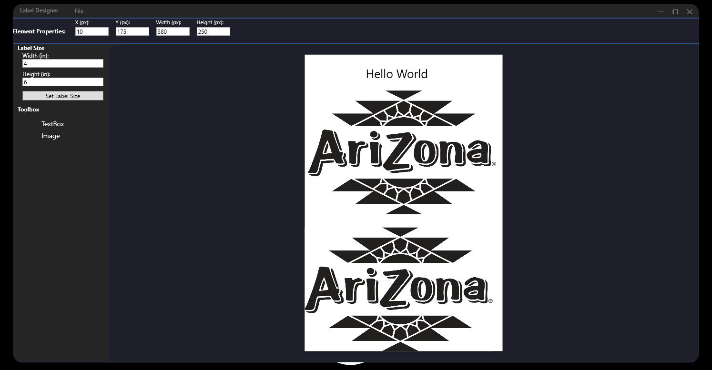

# LabelPrinting

LabelPrinting is a small solution providing a WPF label designer and a web API for managing and printing labels to different printer backends (Zebra TCP and PDF). This README explains the repository structure, how to build and run the projects, how to use the API, and contribution and coding standard references.

## Preview

Here is a preview of how it works:


### Designer
- Zebra Print vs Template


### API

- there is two ways to print either by sending it to a zebra printer or pdf file

- check list of the avaialble printers


- do the print job (PDF)


- do the print job (Zebra simulator)


- Adding new printer types is simple by adding a new class implmenting the print job

## Table of Contents

- [Repository Structure](#repository-structure)
- [Requirements](#requirements)
- [Build and Run](#build-and-run)
  - [Using Visual Studio 2022](#using-visual-studio-2022)
  - [Using dotnet CLI](#using-dotnet-cli)
- [Label Designer (WPF)](#label-designer-wpf)
- [API](#api)
  - [Available Endpoints](#available-endpoints)
  - [Example HTTP Requests](#example-http-requests)
- [Printers](#printers)
  - [Zebra over TCP](#zebra-over-tcp)
  - [PDF Output](#pdf-output)
- [To Do](#to-do)

## Repository Structure

This repository contains multiple projects in a single solution. Key folders:

- `LabelPrinting.API` - ASP.NET Core Web API for managing printers and printing labels.
- `LabelPrinting.Application` - Application layer DTOs and services.
- `LabelPrinting.Domain` - Domain entities (Label, elements, etc.).
- `LabelPrinting.Infrastructure` - Implementation of printers (Zebra TCP, PDF) and other infrastructure concerns.
- `LabelDesigner` - WPF application to visually design labels.

## Requirements

- .NET SDK 8.0
- Visual Studio 2022 (recommended) or later, or `dotnet` CLI
- Windows for the WPF designer (LabelDesigner)

## Build and Run

### Using Visual Studio 2022

1. Open `LabelPrinting.sln` in Visual Studio 2022.
2. Set the desired startup project:
   - `LabelPrinting.API` to run the web API.
   - `LabelDesigner` to run the WPF label designer.
3. Restore NuGet packages and build the solution.
4. Run the project(s) you need.

### Using dotnet CLI

From the solution root:

```bash
# Restore
dotnet restore

# Build
dotnet build

# Run API
cd LabelPrinting.API
dotnet run

# Run WPF app (Windows only)
cd ../LabelDesigner
dotnet run
```

## Label Designer (WPF)

The designer allows creating label layouts in a pixel-based canvas using a designer scale of 100 pixels per inch. You can add text elements, drag them, edit text, and save/load designs to `.lbl` files (JSON). Designs include element positions and sizes and label dimensions in inches.

Saved labels can be printed via the API or using the built-in PDF exporter (infrastructure).

## API

The Web API exposes endpoints to manage printers and submit print jobs.

### Available Endpoints

- `GET /api/printer` - List all configured printers
- `GET /api/printer/{id}` - Get printer by id (GUID)
- `POST /api/printer` - Add a new printer (JSON payload)
- `POST /api/printer/test/{id}` - Test connectivity to configured printer
- `POST /api/label/print` - Submit a print job (this project contains an HTTP collection example)

### Example HTTP Requests

An example HTTP collection (`LabelPrinting.API.http`) is included at the repository root. Example snippets:

- Add a printer

```
POST http://localhost:5000/api/printer
Content-Type: application/json

{
    "Name" : "Zebra Printer 3",
    "IP" : "127.0.0.1",
    "PORT" : 9100,
    "TYPE" : "ZEBRA",
    "ACTIVE" : true
}
```

- Test printer connectivity

```
POST http://localhost:5000/api/printer/test/{printer-id}
```

- Print a label

```
POST http://localhost:5000/api/label/print
Content-Type: application/json

{
    "PrinterId": "<printer-guid>",
    "LabelPath": "C:\\path\\to\\design.lbl"
}
```

Adjust the host and ports as appropriate for your local environment (the HTTP file contains example addresses).

## Printers

### Zebra over TCP

`ZebraTcpPrinter` converts the designer coordinates (100 px/in) into printer dots using the configured DPI (currently 203 dpi). It builds ZPL commands and sends them to the printer via TCP.

- Ensure the printer IP and port are reachable and correct.
- The API provides a `test` endpoint that attempts a TCP connection to the configured printer.

### PDF Output

`PdfLabelPrinter` produces a PDF file using QuestPDF. It converts designer pixels into PDF points (72 points/in) and renders text elements onto a PDF of the specified label dimensions.

The generated PDF is saved to the working directory using a sanitized file name based on the label name.


### TO DO
- Add an automatic print job where the job gets inserted into a table in the db and the api keeps scanning it
- Add Picture, Barcode, Dynamic Fields
- Validation where no 2 printers with the same IP
- hot keys functionality in the desiginer
- deleting printers
- updating printers
- Before Printing Test printer is connected and active
- When File is edited by the designer it should make that file active or sth so its not editable
-limit resizing label so you cant resize smaller than biggest image


### Designer Dev Stages

- user builds the label in the designer


- user can save or load (.lbl) files


- New Design


- Added Top Window Bar


- Added Picture and General Element Properties
